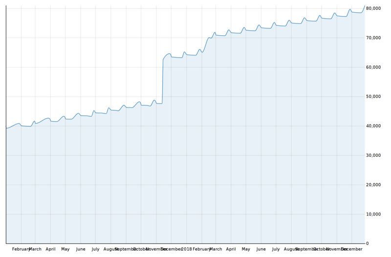
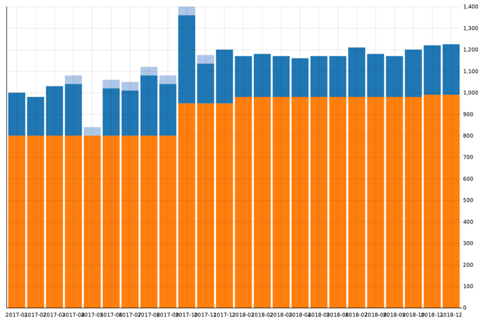

# ledger-d3

Scripts to generate D3-based asset and expense graphs.


# Usage

```
$ assets.py -f 2018.ledger [-o assets.html] [--commodity USD] [^Assets]
$ expenses.py -f 2018.ledger [-o expenses.html] [--commodity USD] [^Expenses]
```

The `--file` (`-f`) option specifies a ledger data file.
`--output` (`-o`) specifies an output file; by default, it goes to standard output.
`--commodity` lets you choose a currency if your ledger uses more than one.
(NOTE: any postings in other currencies are skipped!)

Any other command line arguments are passed to a `ledger register` query;
see Ledger documentation for possible options.

You will probably want to limit the `expenses.py` query
to a date range excluding the opening balances.


# Dependencies

On Ubuntu Focal:

```
$ sudo add-apt-repository ppa:yurivkhan/ledger
$ sudo apt update
$ sudo apt install python3-ledger python3-jinja2
```

(In future, as soon as Ubuntu pulls in Ledger 3.2.0,
the PPA will become unnecessary.)

On Windows, Mac, and GNU/Linux other than Ubuntu,
please figure out the environment for yourselves.
You need Python 3,
Ledger bindings for Python,
and Jinja 2.

# Examples

You can find an example ledger file in `examples`.

## Assets



## Expenses


